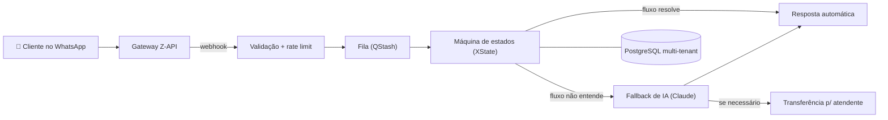

<h1 align="center">Attenda</h1>

  <b>Atendimento automatizado no WhatsApp para pequenos negócios</b> 
  🟢 Em produção em <a href="https://attenda.tec.br"><b>attenda.tec.br</b></a>

  
  
  
  
  

> 🔒 **O código-fonte é privado.** Este repositório documenta o produto, a arquitetura e as decisões de engenharia.

---

## 💡 O que é

A Attenda é uma plataforma SaaS **multi-tenant** que automatiza o atendimento de pequenos negócios no WhatsApp: menus de autoatendimento, FAQ, **agendamentos**, **CRM** e transferência para atendente humano — com uma IA de retaguarda que entra em ação apenas quando o fluxo estruturado não entende o cliente.

## ✨ Funcionalidades

- 📊 **Dashboard** — visão geral de consumo (conversas e IA vs. plano) e funil de CRM
- 💬 **Inbox ao vivo** — histórico das conversas, resposta manual pelo painel, edição/exclusão de mensagens e finalização de atendimento
- 🔀 **Editor de fluxos** — árvore de menus (FAQ, coleta de dados, submenu, transferência, agendamento), horário de atendimento e interruptor de IA
- 🧠 **IA invisível de retaguarda** — responde com base na FAQ e no tom de voz do negócio; sabe encaminhar para humano quando necessário
- 📚 **Sugestões de FAQ** — curadoria do que a IA aprende com as conversas reais
- 📅 **Agendamentos** — serviços, equipe/recursos, grades de disponibilidade, agenda com conclusão/cancelamento
- 🗂️ **CRM** — funil kanban com negócios, tarefas e notas
- 📱 **Conexão WhatsApp** — QR code, status da conexão e números confiáveis
- 🛠️ **Painel administrativo** — gestão de contas/tenants, códigos de cadastro, log de auditoria e login próprio com 2FA por e-mail

## 🖼️ Telas

> 🚧 Screenshots do painel em breve.

## 🏗️ Como funciona

- **Multi-tenancy** — todas as entidades de negócio são escopadas por tenant no PostgreSQL; políticas de RLS no banco e escopo por tenant em todas as consultas
- **Processamento assíncrono** — o webhook enfileira a mensagem e responde na hora; um worker processa em seguida (com fallback inline para nenhuma mensagem se perder)
- **Conversas como máquina de estados** — saudação → menu → FAQ / coleta de dados / agendamento / transferência / feedback, tudo modelado com XState
- **IA com papel coadjuvante** — a IA (Claude Haiku, via SDK da Anthropic) só entra quando o fluxo estruturado não resolve, mantendo custo e comportamento previsíveis

## 🧰 Stack

| Camada | Tecnologias |
|---|---|
| **Front-end** | Next.js 15 (App Router) · React 19 · TypeScript · Tailwind CSS |
| **Back-end** | Next.js API routes · XState 5 · Zod · Drizzle ORM |
| **Banco & Auth** | PostgreSQL (Supabase) · Supabase Auth · RLS |
| **Mensageria** | Z-API (gateway WhatsApp) · Upstash QStash (fila) · Upstash Redis (rate limiting) |
| **IA** | API Claude (Anthropic) |
| **Operação** | Vercel (deploy + cron) · Sentry (monitoramento server-side) · pino (logs estruturados) · Cloudflare Turnstile (anti-bot) |
| **Qualidade** | Vitest · ESLint · Prettier · Husky + lint-staged |

## ✅ Qualidade e operação

- 🧪 **~255 testes automatizados** (Vitest) cobrindo domínio, motor de conversas, serviços e integrações
- 🔐 **Revisão de segurança formal** — CSP, HSTS, comparação de segredos em tempo constante, anti-bot Turnstile
- 📝 **Documentação viva** — 8 sprints documentadas, ADRs de arquitetura e roadmap
- ♻️ **Validação contínua** — typecheck, lint e testes a cada mudança + preview deployments na Vercel

## 🛡️ LGPD por padrão

- Ciclo de vida da conta com **soft delete** e retenção de 30 dias após cancelamento
- **Expurgo definitivo automatizado** — rotina diária (cron) remove dados de contas canceladas
- **Export de dados** completo do tenant em um clique
- **Log de auditoria** que sobrevive à exclusão da conta
- Páginas públicas de privacidade, termos e LGPD

## 📈 Em números

| | |
|---|---|
| Páginas no app | **20** |
| Endpoints de API | **50** |
| Tabelas no banco | **22** |
| Testes automatizados | **~255** |

---

  Projeto desenvolvido em dupla, com IA como ferramenta de apoio no fluxo de desenvolvimento. 
  <a href="https://attenda.tec.br">attenda.tec.br</a>

